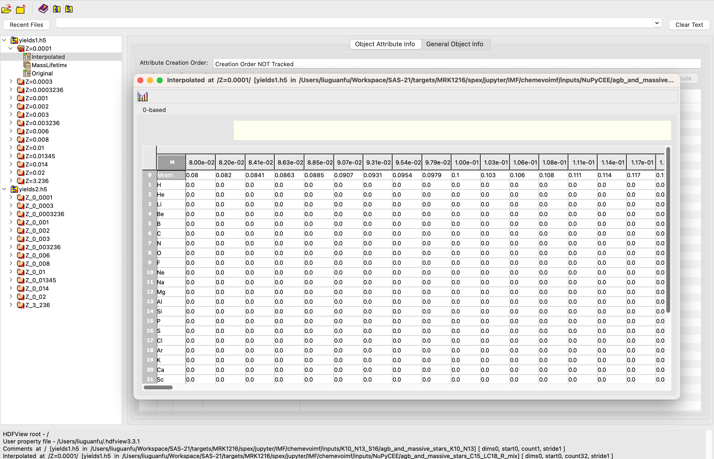

# Structure of the repository

## `./inputs/`
It contains the essential input files for the calculation of chemical evolution with variant or invariant IMF.
The essential input files are:
- Stellar yields
- Star formation history

### `./inputs/K10_N13_S16/`

The pre-processed stellar yields from [Karakas et al. (2010)](https://academic.oup.com/mnras/article-lookup/doi/10.1111/j.1365-2966.2009.16198.x), [Nomoto et al. (2013)](https://www.annualreviews.org/doi/10.1146/annurev-astro-082812-140956), and [Sukhbold et al. (2016)](https://iopscience.iop.org/article/10.3847/0004-637X/821/1/38) are stored in this directory.

A single sub-directory `./inputs/K10_N13_S16/` contains a single set of stellar yields, which should contain `yields1.h5` and `yields2.h5`.
There may be some other files but all the information is stored in these two files.

### `./inputs/NuPyCEE/`

The pre-processed stellar yields from [NuPyCEE](https://github.com/NuGrid/NuPyCEE)

A single sub-directory `./inputs/NuPyCEE/` contains a single set of stellar yields, which should contain `yields1.h5` and `yields2.h5`.
There may be some other files but all the information is stored in these two files.

### `./inputs/SFH.h5`, `./inputs/SFH-1delta.txt`, and `./inputs/SFH-1square.txt`

The star formation history (SFH) files.

## `./outputs/`

It contains the output files of the calculation of chemical evolution with variant or invariant IMF.
The output files are named `YYYY-MM-DD-HH-MM-SS.`h5`.
The name convention can be changed according to the user's preference.

## `./primordial_gas.py`

Define the primordial gas composition.

## `./IMF.py`

Define the IMF.

## `./SupernoaveIa.py`

Define the delay-time distribution of SNe Ia.

## `./utils.py`

The utility functions, like the mass lifetime relation.

## `./constants.py`

Define some important constants, like the solar abundance table, atomic weights, solar metallicity, the minimum and maximum initial mass of stars, etc.

# Some conventions

## Conventions of the stellar yields file

There are two kinds of stellar yield files, which are named `yields1.h5` and `yields2.h5`.
They are just different formats but contain the same information.

Take `yields1.h5` as an example, the stellar yields of different initial metallicities are stored in different groups, like `Z=0.0001`, `Z=0.0003`, etc.
The name of groups cannot contain special characters like `=` and `.` when using `pandas.to_hdf()` to save the data frame to the hdf5 file.
Therefore, the `=` and `.` in the group name are replaced by `_` in `yields2.h`.

The are several datasets in each group, like `Interpolated`, `Original`, and `MassLifetime`.
ONLY the dataset `Interpolated` is used in the calculation of chemical evolution.

<figure style="text-align: center;">
  
  <figcaption>

   The yields files `./inputs/NuPyCEE/agb_and_massive_stars_C15_LC18_R_mix/yields1.h5` and `./inputs/NuPyCEE/agb_and_massive_stars_C15_LC18_R_mix/yields2.h5`
  </figcaption>
</figure>

## Units

- Mass: solar mass $M_{\odot}$.
- Time: yr.

## The interpolation/extrapolation of the stellar yields

Both the mass range of the IMF and the stellar yield tables is restricted to be $[0.08,150]~M_{\odot}$
   
   - If the minimum mass $M_{\rm min}$ of the IMF is larger than $0.08~M_{\odot}$, then the IMF in the range $[0.08,M_{\rm min}]~M_{\odot}$ is set to be zero.
   - As is often the case, the $M_{\rm min}$ in the stellar yield tables is larger than $0.08~M_{\odot}$, so the yield in the range $[0.08, M_{\rm min}]~M_{\odot}$ is set to be zero, and the $M_{\rm max}$ in the stellar yield tables is smaller than $150~M_{\odot}$, so the yield in the range $[M_{\rm max},150]~M_{\odot}$ is set to be the same as that at $M_{\rm max}$. As for the $M_{\rm rem}$, it is set to be $M_{\rm ini}$ in the range $[0.08,M_{\rm min}]~M_{\odot}$ and we keep $M_{\rm ini}-M_{\rm rem}$ a constant in the range $[M_{\rm max},150]~M_{\odot}$.
   - The number of sampled mass points in the stellar yield tables is often just a few, so we will interpolate the yield tables to get the yield at any mass in the range $[0.08,150]~M_{\odot}$.
  
## Solar abundance table

- The solar abundance tables are taken from [SPEX](https://spex-xray.github.io/spex-help/reference/commands/abundance.html) but converted to the ratio of the mass of each element to the mass of H.
- The shape of a single solar abundance table `abund_table` is `(32,)`
 `abund_table[0]` is zero and should be ignored, which is used to make the index of the element the same as the atomic number.
 `abund_table[1:31]` is the mass ratio of each element to the mass of H. We only consider the first 30 elements.
 `abund_table[31]` is also zero, which stands for the mass ratio of the elements heavier than Zn to the mass of H.

## Variables

| Field           | Type                | Unit    | Dims      | Description                                                                                                                                                                                                                                                                                                                                                                  |
|-----------------|---------------------|---------|-----------|------------------------------------------------------------------------------------------------------------------------------------------------------------------------------------------------------------------------------------------------------------------------------------------------------------------------------------------------------------------------------|
| Age             | float               | yr      | N         | The age                                                                                                                                                                                                                                                                                                                                                                      |
| SFR             | float               | Msun/yr | N         | Star formation rate of this age. Note that the non-zero star formation rate at the last age has no time to take any effect. The star formation is assumed to be instantaneous.                                                                                                                                                                                               |
| TimeBin         | float               | yr      | N         | Defined as the next age - this age. Note that the last element of TimeBin is set to be zero as there is no the next age for the last age.                                                                                                                                                                                                                                    |
| Mstar           | float               | yr      | N         | The total mass of the newly formed stars during the epoch just after this age, which is SFR*TimeBin. Note that it will always be zeors for the last age as TimeBin is set to be zero for the last age.                                                                                                                                                                       |
| Nstar           | float               | yr      | N         | The number of of the newly formed stars during the epoch just after this age. Note that it will always be zeros for the last age as TimeBin is set to be zero for the last age.                                                                                                                                                                                              |
| YieldsTable     | str                 | ~       | N         | The name of stellar yields table files. It will be "NoFile" for ages with zero star formation rate and the last age.                                                                                                                                                                                                                                                         |
| GasElement      | numpy arrray        | Msun    | (N, 32)   | The mass of H, He, Li, ..., Zn, and other metals of the gas of each ages. The index of element starts from 1. For instance, GasElement[0,1] is the mass of H in the first age. GasElement[:,0] is set to be zero.                                                                                                                                                            |
| StarInitElement | numpy arrray        | Msun    | (N, 32)   | The mass of H, He, Li, ..., Zn, and other metals of the  zero age main sequence (ZAMS) of each ages. We do not consider the contribution of the dead stars,like the white dwarfs. The index of element starts from 1. For instance, GasElement[0,1] is the mass of H in the first age. GasElement[:,0] is set to be zero.                                                    |
| EjectElement    | numpy arrray        | Msun    | (N, 32)   | The mass of H, He, Li, ..., Zn, and other metals of the ejecta from this age to the next age. Here the `ejecta` also includes the winds from AGB stars.  It includes the ejecta from all already formed stars. For instance, EjectElement[5,1] is the total mass of ejecta of H up to the 6th age. The index of element starts from 1 and GasElement[:,0] is set to be zero. |
| dEjectElement   | numpy arrray        | Msun    | (N, 32)   | dEjectElement[i,:] indicates the ejecta during Age[i] and Age[i+1] of the stellar population formed just after Age[j]. This variable won't be output. It will be initilized to be zero before calculation the ejceta of each epoch. If j<i, dEjectElement is zero.                                                                                                           |
| SNIaNum         | numpy arrray        | 1       | N         | The total number of SNIa events from this age to the next age                                                                                                                                                                                                                                                                                                                |
| dSNIaNum        | numpy arrray        | 1       | N         | Similar to dEjectElement, but for the number of the SNIa events.                                                                                                                                                                                                                                                                                                             |
| ZGas            | float               | 1       | N         | The metallicity of gas, which is defined as the mass fraction                                                                                                                                                                                                                                                                                                                |
| IMF             | numpy arrray or str | Msun, 1 | (N, 2), 1 | The first column is the initial mass, while the second is the IMF. If it is a string, it should be either of 'Salpeter', 'Chabrier', 'Kroupa', 'PowerLaw' (with power index provided) or 'DietSalpeter'.                                                                                                                                                                     |
